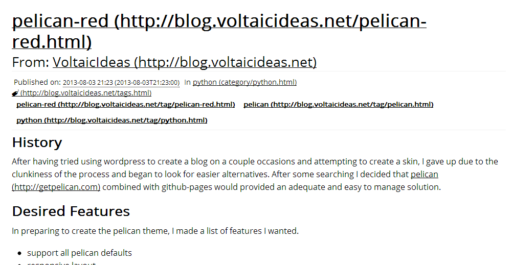

Pelican-red
============

Pelican-red is a [pelican](http://getpelican.com) theme designed to be readable on every device. It is a responsive layout which utilizes the [Foundation 4](http://foundation.zurb.com/) framework. The theme was originally created for the blog [VoltaicIdeas](http://blog.voltaicideas.net) and has a few additional features in addition to the original design to make it more useful. Pelican-red is Licensed under the MIT-License.     

Features
---------
The following is a list of features:

* Responsive design view-able on mobile down to about 300px wide
* Top-bar w/drop-down navigation & social links
    * Social links with Icons from [Entypo](http://www.entypo.com) by Daniel Bruce or [Zocial](http://zocial.smcllns.com/) by Sam Collins; currently supported ( icon font pack in parenthesis ):
        * Blogger ( Zocial )
        * Dribbble ( Entypo )
        * Facebook ( Entypo )
        * Flickr ( Entypo )
        * Github ( Entypo ) 
        * GrooveShark ( Zocial )  
        * Google+ ( Entypo )
        * Instagram ( Entypo )
        * Lastfm ( Entypo )
        * LinkedIn ( Entypo )
        * Picasa ( Entypo )
        * Pinterest ( Entypo )
        * Rdio ( Entypo )
        * Reddit ( Zocial )
        * Skype ( Entypo )
        * SoundCloud ( Entypo )
        * Steam ( Zocial )
        * StumbleUpon ( Entypo )
        * Tumblr ( Entypo )
        * Twitter ( Entypo )
        * Vimeo ( Entypo )
        * YouTube ( Zocial )
* Style-sheets built using sass & compass 
* zeptos.js used instead of jQuery when possible
* Javascript files loaded via [yepnope.js](http://yepnopejs.com/) (part of modernizr) from CDN [jsDelivr](http://www.jsdelivr.com/) with local fallback
* Analytics via Google Analytics ( new version ) or GoSquared 
* Disqus comments support  
* pygments code highlighting with responsive layout
* Site Icons for Creative Commons Licenses, VCards, Tags, PDF download, Search, and Translation selection using [Entypo](http://www.entypo.com) by Daniel Bruce
* Google Custom Search Support (works with overlay)
* Open Sans used for style font
* Source Code Pro used for code blocks
* Vcards (hcards) and micro-formatting for articles, pages, and authors
* Supports the following pelican-plugins (plus others):
  * multi_part
  * neighbors
  * related_posts

Install
--------

To install pelican-red first either clone the repository or download the zip of the current version to a destination of your choice ( `~/pelican-red` used in example ):
~~~Shell
git clone https://github.com/arsenetar/pelican-red.git ~/pelican-red
~~~
or
~~~Shell
wget https://github.com/arsenetar/pelican-red/archive/master.zip
unzip master.zip
mv pelican-red-master ~/pelican-red
~~~
The theme can then either be used by installing the theme or just by pointing to it.

### Option 1 - Install
Using pelican-themes (~/pelican-red is path to the theme used in previous example):
~~~Shell
pelican-themes --install ~/pelican-red
~~~
Then change the theme in the Pelican settings file for the site you want to use pelican-red:
~~~Python
THEME = "pelican-red"
~~~

### Option 2 - Just Point to It

Edit your Pelican settings file for the site you want to use pelican-red (~/pelican-red is path to the theme used in previous example):
~~~Python
THEME = "~/pelican-red"
~~~

Configuration
--------------
In addition the to general Pelican configuration variables pelican-red supports a few additional settings.  All the variables are set in your Pelican settings file for the site you are using pelican-red with.

Variables are listed as `variable` : description

### General
* `SITE_DESCR`: Description of site used for meta if you want
* `SITE_KEY`: Keywords for meta ex. `"keyword1, keyword2, keyword3"`
* `FAVICON`: Path to favicon ex. `images/favicon`
* `PAGE_DESC` : a dictionary of page descriptions used to generate unique description meta on articles.html, authors.html, index.html, tags.html, and categories.html pages; keyed on lowercase page name.

### Copyright
* `COPYRIGHTS`: Copyright dictionary `['Abbreviation': ('name','url')]`
  * using `cc`, `cc-nc`, etc will generate iconified copyright links
* `DEFAULT_COPYRIGHT` : Default copyright to use is an abbreviation key from the `COPYRIGHTS` dictionary 
* `COPYRIGHT_ARTICLE` : Show default copyright on articles (over-ridable with article value)
* `COPYRIGHT_PAGE` : Show default copyright on pages (over-ridable with page value)
* `COPYRIGHT_HOLDER` : set the holder of the copyright, defaults to `AUTHOR`
* `COPYRIGHT_YEAR` : set the copyright year, no default value

### Navigation
* `MENUITEMS`: Custom Links to place in the menu e. `(('Item', 'Link'))`
* `DISPLAY_PAGES_ON_MENU`: Show pages on the menu; has three options `False` - do not display, `Compact` - display as dropdown with 'Pages' Heading, and `Expanded` - display each as a seperate top level item.
* `DISPLAY_CATEGORIES_ON_MENU` : Show the categories on the menu; has same options `False` - do not display, `Compact` - display as dropdown with 'Categories' Heading, and `Expanded` - display each as a seperate top level item.
* `DISPLAY_ARCHIVE_ON_MENU` : True / False Show a link to the archive on the navigation menu

### Sidebar
* `INCLUDE_TAGS_LINK` : True / False Include link to tags page on sidebar.
* `INCLUDE_CATS_LINK` : True / False Include link to categories page on sidebar.
* `INCLUDE_ARCH_LINK` : True / False Include link to archives page on sidebar.
* `INCLUDE_AUTH_LINK` : True / False Include link to authors page on sidebar.

### Social
* `SOCIAL`: List of the social links and urls ex. `(('Network','url'),)`, supported w/icon listed below:
    * Blogger : `('blogger','http://myblog.blogspot.com')`
    * Dribbble : `('dribble','http://dribbble.com/username')`
    * Facebook : `('facebook','http://www.facebook.com/username')`
    * Flickr : `('flickr','http://www.flikr.com/photos/username')`
    * Github : `('github','https://github.com/username')`
    * GrooveShark : `('grooveshark','http://grooveshark.com/username')`
    * Google+ : `('gplus','https://plus.google.com/profileID')`
    * Instagram : `('instagram','http://instagram.com/username')`
    * Lastfm : `('lasstfm','http://www.last.fm/user/username')`
    * LinkedIn : `('linkedin','http://www.linkedin.com/in/username')`
    * Picasa : `('picasa','http://')`
    * Pinterest : `('pinterest','http://pinterest.com/username')`
    * Rdio : `('rdio','http://www.rdio.com/people/username')`
    * Reddit : `('reddit','http://www.reddit.com/user/username')`
    * Skype : `('skype','skype:username?chat')`
    * SoundCloud : `('soudcloud','https://soundcloud.com/profileID')`
    * Steam : `('steam','http://steamcommunity.com/profiles/profileID')`
    * StumbleUpon : `('stumbleupon','http://www.stumbleupon.com/stumbler/username')`
    * Tumblr : `('tumblr','http://myblog.tumblr.com')`
    * Twitter : `('twitter','http://twitter.com/username')`
    * Vimeo : `('vimeo','http://vimeo.com/channels/channelID')`
    * YouTube : `('youtube','http://www.youtube.com/channel/channelID')`

### Index Page
* `ARTICLES_ON_INDEX` : number of recent articles to show
* `PAGES_ON_INDEX` : True / False

### Comments ( Disqus )
* `DISQUS_SN`: Disqus Shortname of site ( VoltaicIdeas )
* `COMMENTS_PAGE`: Include Comments on pages set True/False
* `COMMENTS_ARTICLE`: Include Comments on articles set True/False

### Authors ( vcards / hcards ) w/ microformats
* `AUTHORS` : a dictionary of authors
  * `vcard` : a tuple of tuples of author vcard values support includes (not limited though ):
    * `fn` : Full Name
    * `email` : name@service.com
    * `photo` : url to an image about 150px
    * `title` : Awesome Person, Blog Writer, etc
    * `org` : some company
    * `notes` : this can be a bio / anything really
  * `social` : (('network','link'),) same as SITE_SOCIAL parameters

### Analytics ( Google Analytics and GoSquared )
* `GOOGLE_ANALYTICS`: Google Analytics Code and Domain ex. `( UA-xxxxxxxx-x' , 'voltaicideas.net' )`
* `GO_SQUARED`: GoSquared Code ex. `'GSN-xxxxxx-x'`

### Google Custom Search
* `GOOGLE_SEARCH`: set to the unique search id number "var cx = 'this value' "

Per Article / Page Variables
--------------------------
In addition to the additional configuration variables the theme supports the following variables in articles / pages.

* `comments`: show comments True/False overrides the site comments setting
* `copyright`: copyright to display at bottom of page / article overrides the site `DEFAULT_COPYRIGHT` value
* `modified` : a modified time
* `image` : a cover image for the article also used as icon in listings path relative to `static` directory

Previews
---------
A live preview of the theme can be seen on the blog [VoltaicIdeas](http://blog.voltaicideas.net). 

Previews of the site main page are shown below as desktop and mobile (bonus print preview of article).

### Desktop Previews

### Mobile Previews

### Print Preview (print layout to be improved & disqus hidden)

TODO
-----
* Allow for multilevel MENUITEMS
* Migrate some template hacks into pelican plugins

Change-log ( Major Details )
-------------------------
* `v0.1.0` First Release <- Current